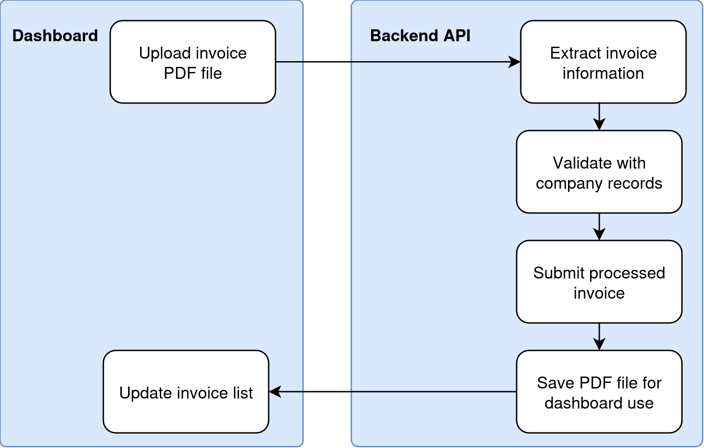
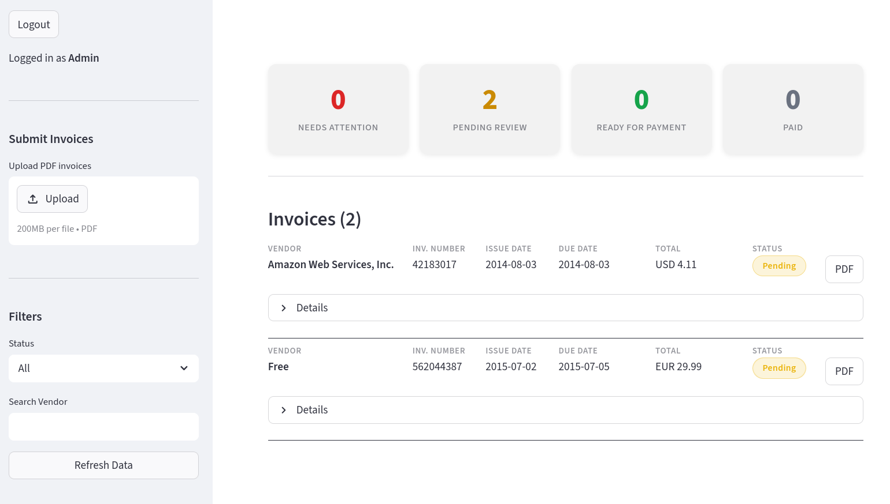
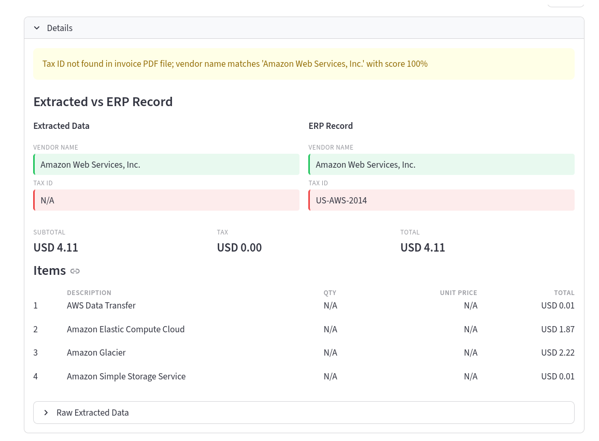

# Invoice Processing Pipeline
The project was implemented using Python, with libraries managed by `uv`. The project's source code is available in https://github.com/Minipoloalex/invoice-processing-pipeline.

## Tools and libraries
- `fastapi` and `uvicorn`: to build and support the backend Python API
- `httpx`: to perform asynchronous requests to the ERP API and to the backend API (from the dashboard)
- `google-genai` and the model `gemini-flash-lite-latest` to extract information from the invoice PDFs
- `pydantic` for model validation, both regarding the backend API and the LLM extraction call
- `rapidfuzz` for matching company names to extracted vendor names
- `streamlit` and `streamlit-authenticator` for the implementation of the dashboard and authentication

## Project Structure
```bash
services/
    erp_client.py       # communicates with the ERP database
    pdf_extractor.py    # handles extracting information from an invoice PDF
    validator.py        # validates extracted information against the company database
    pipeline.py         # the complete pipeline based on other services
config.py               # environment variables (loaded from .env)
models.py               # pydantic models
dashboard.py            # streamlit dashboard
main.py                 # main backend API
```


## Main pipeline
The pipeline starts and ends at the dashboard. First, the user uploads a file to the backend. The backend processes it, and then returns the invoice information.

The main pipeline for extracting information from invoice PDF files is shown in the image and code snippet below. It is composed of several stages:
- Extract: uses an LLM, in this case, [gemini-flash-lite-latest](https://blog.google/innovation-and-ai/models-and-research/gemini-models/gemini-3-1-flash-lite/) through the `google-genai` API to extract information from the PDF. It uses `pydantic` models to ensure the information is in the correct format.
- Validate: uses fuzzy matching from the library `rapidfuzz` to look for the extracted company name within the database companies.
- Submit: submits the processed invoice information through the ERP API using `httpx`.
The pipeline also saves the uploaded PDF file to allow previewing the file in the dashboard.



A shortened version of the pipeline from `services/pipeline.py`:
```python

async def process_invoice(pdf_bytes: bytes, filename: str) -> ProcessedInvoice:
    # Extract structured data from PDF via an LLM
    extracted: ExtractedInvoice = await extract_invoice_data(pdf_bytes, filename)

    # Normalize extracted fields
    ... # omitted for brevity

    # Fetch vendor records from ERP
    companies = await fetch_companies()

    # Validate extracted data against ERP records
    status, discrepancies, matched_vendor_id, name_matches, match_score = validate_invoice(
        extracted, companies
    )

    # Build enriched ExtractedData with validation results
    enriched_data = ExtractedData(
        **extracted.model_dump(),
        erpVendorId=matched_vendor_id,
        vendorNameMatchOk=name_matches,
        validationStatus=status,
        validationErrors=discrepancies,
    )

    # Build notes describing validation outcome
    notes = ... # omitted for brevity

    # Build invoice
    invoice = ProcessedInvoice(
        fileName=filename,
        extractedData=enriched_data,
        confidenceScore=match_score,
        processingNotes=notes,
    )

    # Submit to ERP
    erp_response = await submit_processed_invoice(invoice)
    invoice.id = erp_response["id"]

    # Save PDF for later preview
    PDF_DIR.mkdir(exist_ok=True)
    (PDF_DIR / filename).write_bytes(pdf_bytes)
    return invoice
```

## Backend API
The backend API supports:
- `/api/upload`: uploads an invoice PDF file, processes it and returns its information
- `/api/companies`: acts as a proxy to the ERP API, retrieving information about the companies
- `/api/invoices`: acts as a proxy to the ERP API, retrieving information from each processed invoice. The dashboard uses it display each invoice's details
- `/api/invoices/{file_name:path}/pdf`: retrieves an invoice PDF file, previously saved in the file system

Since the dashboard uses authentication, the backend API requires an API key to authorize any of these requests.

### Invoice processing design choices
For controlling the state of an invoice, the implementation uses 4 possible status. Note that changing the status of an invoice was not implemented.
- Flagged:
    - Mismatch between `taxID` and company found during extraction, or simply none found
    - Issue flagged by an analyst (not implemented)
- Pending: finished extraction process, pending review from an analyst
- Verified: an analyst has verified the invoice information, making it ready for payment (not implemented)
- Complete: invoice marked by a manager as paid (not implemented)

## Dashboard
The dashboard requires logging in. The username is `admin` and password `admin123`.

The dashboard presents several features:
- Uploading invoice PDF files (one or more at once) to be sent to the backend API for extraction and processing.
- Listing processed invoices, filtered according to their status (e.g., flagged) or according to the company's name.
- Consulting detailed information from each invoice, including the comparison with the ERP database company records. It also supports downloading the originally submitted invoice PDF file.

| Main dashboard |
| :-: |
|  |

| Expanded Invoice |
| :-: |
|  |

## Future work
- Modify an invoice's status
- Modify an invoice's extracted information (crucial for fixing inconsistencies)
- Deleting invoices (to fix potential user mistakes)
- Toggle a configuration to show active invoices only (hiding older invoices)
